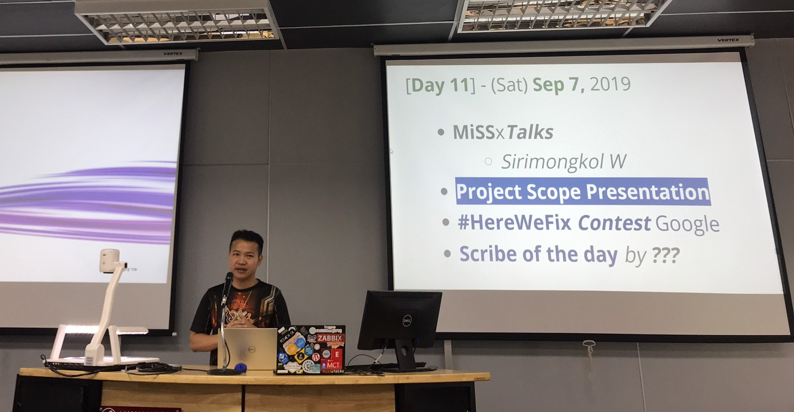

# **"Blockchain We Trust"** *by #BrainShock*!
---

**MUT ALL STAR**

**1. Introduction**

    - What is Blockchain?
    
      Blockchain เป็นเทคโนโลยีที่มาช่วยในเรื่องของการบันทึกข้อมูลที่เราสามารถจะรับประกันความปลอดภัยได้ว่าจะไม่มีใครมาเปลี่ยนแปลงข้อมูลที่เราได้บันทึกไปก่อนหน้าได้
     เพราะเนื่องจากทุกคนจะมีการแชร์ข้อมูลกันไว้เหมือนเป็นห่วงโซ่ที่ต่อ ๆ กันไป ถ้าจะต้องมีการเปลี่ยนแปลงข้อมูลเกิดขึ้นก็จต้องทำการไปเปลี่ยนข้อมูลที่อยู่ในทุก blockchain
     ซึ่งในกรณีสามารถทำได้ยากมาก
     
    - Procedure of blockchain
    
      หลักการทำงานของ blockchain คือ ฐานข้อมูลจะถูกแชร์ให้กับทุก Node1 ที่อยู่ในเครือข่ายและการทำงานของเทคโนโลยี Blockchain จะไม่มีเครื่องใดเครื่องหนึ่งเป็นศูนย์กลาง    
      หรือเครื่องแม่ข่าย ซึ่งการทำงานแบบนี้จะไม่ถูกควบคุมโดยคนเดียว แต่จะกระจายข้อมูลออกไปทุกโหนดและจะมีการอัปเดตฐานข้อมูลแบบอัตโนมัติเมื่อมีข้อมูลใหม่เกิดขึ้น
   
    - Contain of blockchain
      
      ส่วนประกอบของ blockchain จะประกอบไปด้วย 4 ส่วน คือ
      1) Block 2) Chain 3) Consensus 4) Validation
   
**2. Ethereum Wallet**

    - What is Ethereum wallet?
      
      Ethereum wallet เป็นกระเป๋าสตางค์ digital ที่ใช้สำหรับใช้งานในระบบของ blockchain
   
    - Meta Mask wallet tool 
   
      เป็นโปรแกรมที่เป็นส่วนเสริมของ web browser ของ Firefox และ Google chrome โดยเราจะใช้ wallet ผ่านโปรแกรมนี้
      
    - How to register to Meta Mask
    
      1. สร้างพาสเวิร์ดจำนวน 8 ตัวอักษร
      2. ขั้นตอนนี้จะได้ Secret Backup Phrase ให้ทำการ copy เก็บไว้ก่อน
      3. ทำการเรียงลำดับ Seed Phrase โดยให้ตรงกับตำแหน่ง Secret Backup Phrase ที่เราได้รับมา
      
    - How to use Meta Mask
      1. ในโปรแกรม Meta Mask มีทั้งเครือข่ายจริงและเครือข่ายทดลอง
      2. โดยการทดสอบครั้งนี้ใช้เครือข่ายทดลองชื่อ Rinkeby
      3. สามารถหาเหรียญได้จากเว็ป https://faucet.rinkeby.io/
   
**3. Smart contract & Solidity**

    - What is Smart Contract?
    
    - Why do we have to trust the Smart Contract?
    
    - Value types
    
    - Writing style (Syntax)
    
    - IDE’s used in development

    - Deploy to test

    - Demo
   
**4. Server backend frontend**

    - Front-End Technology 
    
    - Back-End Technology Stack

**5. Demonstation Program**

* **Team Member**

	1. 6117810005 Mutchima Chuensart
	2. 6117810011 Witsanu Sameajang
	3. 6117810012 Yuttapon Kunkot
	4. 6117810014 Pattama Thongprapai
	5. 6117810016 Tossaporn Hansing
	6. Pongpat Rakdej (Blockchain Specialist)
	7. Maykin Warasart (Project Sponsor)
	
---

##### **[Software Security - NEIS0736](../) (2019)**!
