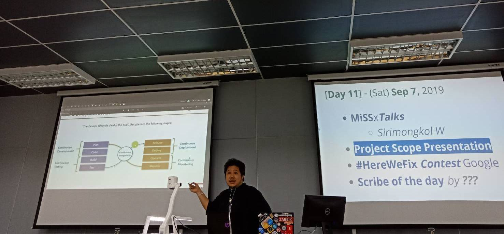

# **"CI/CD We Can"** *by #SonarCute*!
---

---

## **CI (continuous integration)**

* **(Maintainer)**

* Create GitHub Project
	- สร้าง New repository ชื่อ NEIS0736-Project_CI-CD บน Github ของผม
	- เพิ่ม Collaborators ส่วนของผู้ใช้งานหรือ ที่จะมีสิทธิ์เข้ามาทำอะไรได้บ้าง โดยปกติจะเป็น Dev
	- ทั้งนี้ ที่ได้ปรึกษากับพี่อาจ@การเดินทาง  ให้แอดไว้หมดเผื่อให้เข้ามาดูได้ครับ
* Create GitLab CI/CD Project
	- ทำการเชื่อม gitlab กับ github เพื่อให้ เห็น repo  ที่สร้างไว้แล้ว โดยการ new project>CI/CD for external repo>GitHub
	- เราจะเห็นชื่อ repo ที่สร้างไว้บน GitHub. กด Connectแล้ว Go to Project
	- จะถือว่า GitHub = Repo, GitLab = CI/CD พร้อมใช้งานแล้ว
	- ทำการเตรียม Token ของ GitLab Runner  เพื่อส่งต่อให้กับ Sys Admin นำไปใช้สำหรับลงบน Gitlab Runners onTest Server ต่อไป
* **(Developer)**

	* login GitHub และใช้ sonar lint ในการพัฒนาซอสโค้ด

* **(System Admin)**

	* Prepare Server

---

* **2. Maintainer Send GitLab Runner info เพื่อให้ system admin ทำการ install Gitlab runner**

	* yyyy

---

* **3. Maintainer ทำการ connect GitHub กับ Sonar Cloud**

Zzzzzzzzzz

---

* **4. Maintainer + System Admin + Developer หารือกันเพื่อ กำหนดขั้นตอน CI โดยมี Stage (Build, test, Deploy) โดย Build ใช้ Docker(docker-compose.yml) test (Review code ) ใช้ Sonar Cloud ทั้งหมดทำงานด้วย .gitlac-ci.ymlDeveloper จึง Commit และ push code ที่ทำการแก้ไขแล้วเสร็จจากการตรวจของ Sonar Cloud ไปให้ Gitlab CI/CD project**

Zzzzzzzzzz

---

* **5. QA /Tester ทำ UAT หลังจาก Develop ผ่านการแก้ไขจะเข้าสู่กระบวนการ Change เพื่อทำการ Deploy production**

Zzzzzzzzzz

---
# **CD (continuous deployment)**

* **6. System Admin Deploy production และ ทำการ monitoring ต่อไป**

Zzzzzzzzzz

---
* **Team Member**

	1. xxxx
	1. xxxx
	1. xxxx

---

##### **[Software Security - NEIS0736](../) (2019)**!
